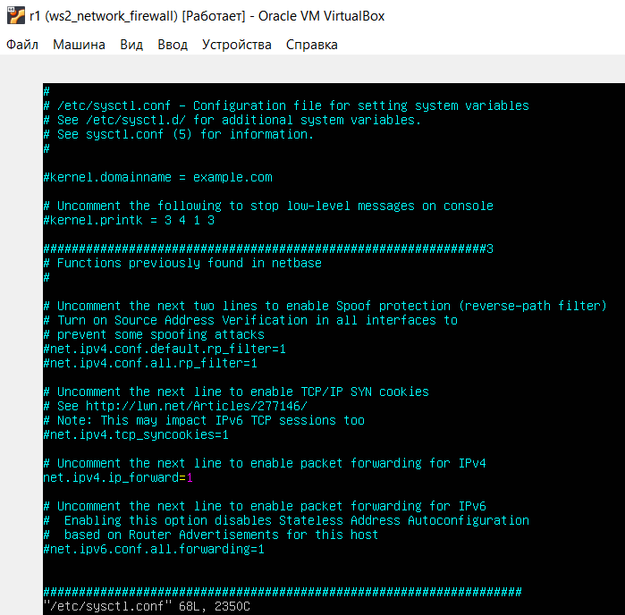
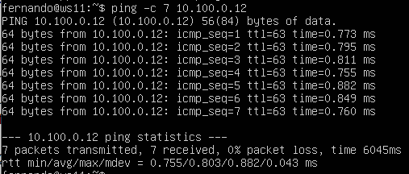
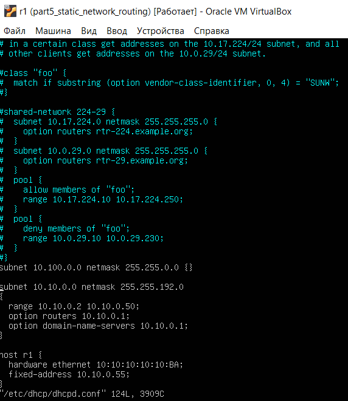
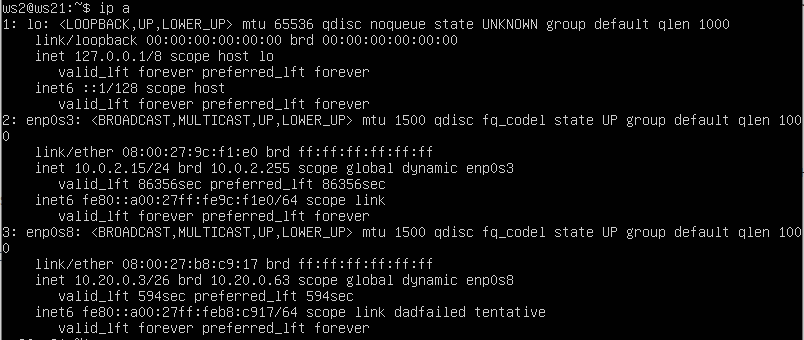
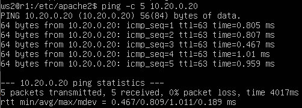

# Сети в Linux

Настройка сетей в Linux на виртуальных машинах.

## Part 1. Инструмент **ipcalc**

**== Задание ==**

##### Поднять виртуальную машину (далее -- ws1)

#### 1.1. Сети и маски
##### Определить и записать в отчёт:
##### 1) Адрес сети *192.167.38.54/13*


- Адрес сети: 192.160.0.0

##### 2) Перевод маски *255.255.255.0* в префиксную и двоичную запись

- Перевод маски 255.255.255.0 в префиксную запись: 24


- Перевод маски в бинарную запись: 11111111.11111111.11111111.00000000

##### */15* в обычную и двоичную

- /15 в обычную: 255.254.0.0
- в двоичную: 11111111.11111110.00000000.00000000


##### *11111111.11111111.11111111.11110000* в обычную и префиксную

- Обычная: 255.255.255.240/28
- Префиксная: 28

##### 3) Минимальный и максимальный хост в сети *12.167.38.4* при масках: */8*


##### *11111111.11111111.00000000.00000000*


##### *255.255.254.0* 


##### */4*


#### 1.2. localhost
##### Определить и записать в отчёт, можно ли обратиться к приложению, работающему на localhost, со следующими IP: *194.34.23.100*, *127.0.0.2*, *127.1.0.1*, *128.0.0.1*

- Нельзя обратиться по: 194.34.23.100 and 128.0.0.1. 
- Можно: 127.0.0.2 and 127.1.0.1, потому что localhist это от 127.0.0.1 до 127.255.255.255


- удачный пинг


- неудачный пинг

#### 1.3. Диапазоны и сегменты сетей
##### Определить и записать в отчёт:
##### 1) какие из перечисленных IP можно использовать в качестве публичного, а какие только в качестве частных: *10.0.0.45*, *134.43.0.2*, *192.168.4.2*, *172.20.250.4*, *172.0.2.1*, *192.172.0.1*, *172.68.0.2*, *172.16.255.255*, *10.10.10.10*, *192.169.168.1*

Частные: 10.0.0.45, 192.168.4.2, 172.20.250.4, 172.16.255.255, 10.10.10.10
Публичные: 134.43.0.2, 172.0.2.1, 192.172.0.1, 172.68.0.2, 192.169.168.1

Частные:
10.0.0.0 – 10.255.255.255;
172.16.0.0 – 172.31.255.255;
192.168.0.0 – 192.168.255.255

Публичные: любой номер, не включенный в зарезервированный диапазон частных IP-адресов

##### 2) какие из перечисленных IP адресов шлюза возможны у сети *10.10.0.0/18*: *10.0.0.1*, *10.10.0.2*, *10.10.10.10*, *10.10.100.1*, *10.10.1.255*


- Возможны: 10.10.0.2, 10.10.10.10, 10.10.1.255

## Part 2. Статическая маршрутизация между двумя машинами

**== Задание ==**

##### Поднять две виртуальные машины (далее -- ws1 и ws2)

##### С помощью команды `ip a` посмотреть существующие сетевые интерфейсы
- В отчёт поместить скрин с вызовом и выводом использованной команды.


- ip a for ws1


- ip a for ws2

##### Описать сетевой интерфейс, соответствующий внутренней сети, на обеих машинах и задать следующие адреса и маски: ws1 - *192.168.100.10*, маска */16*, ws2 - *172.24.116.8*, маска */12*

- The internal network on both machines is 10.0.2.15/24.

- В отчёт поместить скрины с содержанием изменённого файла *etc/netplan/00-installer-config.yaml* для каждой машины.


- ws1

##### Выполнить команду `netplan apply` для перезапуска сервиса сети
- В отчёт поместить скрин с вызовом и выводом использованной команды.


- ip a for ws1


- ws2


- ip a for ws2

#### 2.1. Добавление статического маршрута вручную
##### Добавить статический маршрут от одной машины до другой и обратно при помощи команды вида `ip r add`

- добавим enp0s8
- sudo ip r add 172.24.116.8 dev enp0s8


- ip r 


##### Пропинговать соединение между машинами


- ping ws2


- ping ws1


#### 2.2. Добавление статического маршрута с сохранением
##### Перезапустить машины
##### Добавить статический маршрут от одной машины до другой с помощью файла *etc/netplan/00-installer-config.yaml*
- В отчёт поместить скрин с содержанием изменённого файла *etc/netplan/00-installer-config.yaml*.
##### Пропинговать соединение между машинами


- статический маршрут с сохранением для ws1


- статический маршрут с сохранением для ws2


- ping ws2


- ping ws1

## Part 3. Утилита **iperf3**

#### 3.1. Скорость соединения
##### Перевести и записать в отчёт: 8 Mbps в MB/s, 100 MB/s в Kbps, 1 Gbps в Mbps

- 1 Megabyte/sec is equal to 8 × Megabit/sec.

- 8 Mbps = 1 MB/s

- 100 MB/s = 819200 Kbps

- Объяснение: 1МБ = 1024КБ; 100МБ = 102400КБ; 102400КБ = (8*102400)Кбит = 819200Кбит

- 1 Gbps = 1024 Mbps

#### 3.2. Утилита **iperf3**
##### Измерить скорость соединения между ws1 и ws2
- В отчёт поместить скрины с вызовом и выводом использованных команд.

- ws1


- ws2


To stop the process use:
- pkill -KILL iperf

## Part 4. Сетевой экран

`-` После соединения машин, перед нами стоит следующая задача: контролировать информацию, проходящую по соединению. Для этого используются сетевые экраны.

**== Задание ==**

*В данном задании используются виртуальные машины ws1 и ws2 из Части 2*

#### 4.1. Утилита **iptables**
##### Создать файл */etc/firewall.sh*, имитирующий фаерволл, на ws1 и ws2:
```shell
#!/bin/sh

# Удаление всех правил в таблице "filter" (по-умолчанию).
iptables –F
iptables -X
```
##### Нужно добавить в файл подряд следующие правила:
##### 1) на ws1 применить стратегию когда в начале пишется запрещающее правило, а в конце пишется разрешающее правило (это касается пунктов 4 и 5)
##### 2) на ws2 применить стратегию когда в начале пишется разрешающее правило, а в конце пишется запрещающее правило (это касается пунктов 4 и 5)
##### 3) открыть на машинах доступ для порта 22 (ssh) и порта 80 (http)
##### 4) запретить *echo reply* (машина не должна "пинговаться”, т.е. должна быть блокировка на OUTPUT)
##### 5) разрешить *echo reply* (машина должна "пинговаться")
- В отчёт поместить скрины с содержанием файла */etc/firewall* для каждой машины.
##### Запустить файлы на обеих машинах командами `chmod +x /etc/firewall.sh` и `/etc/firewall.sh`
- В отчёт поместить скрины с запуском обоих файлов.
- В отчёте описать разницу между стратегиями, применёнными в первом и втором файлах.

- ws1


- ws2


- В первом скрине применена стратегия REJECT, затем ACCEPT, потому что нужно применить сначала запрещающее правило, затем разрешающее. Последнее правило разрешающее, поэтому ws1 пингует ws2. На втором скрине второе правило является запрещающим, поэтому мы не можем произвести пинг c ws2 на ws1.

- Write for both machines
```bash
sudo chmod +x /etc/firewall.sh
```
```bash
sudo sh firewall.sh
```


#### 4.2. Утилита **nmap**
##### Командой **ping** найти машину, которая не "пингуется", после чего утилитой **nmap** показать, что хост машины запущен
*Проверка: в выводе nmap должно быть сказано: `Host is up`*
- В отчёт поместить скрины с вызовом и выводом использованных команд **ping** и **nmap**.


##### Сохранить дампы образов виртуальных машин
**p.s. Ни в коем случае не сохранять дампы в гит!**

## Part 5. Статическая маршрутизация сети

##### Поднять пять виртуальных машин (3 рабочие станции (ws11, ws21, ws22) и 2 роутера (r1, r2))

#### 5.1. Настройка адресов машин
##### Настроить конфигурации машин в *etc/netplan/00-installer-config.yaml* согласно сети на рисунке.
- В отчёт поместить скрины с содержанием файла *etc/netplan/00-installer-config.yaml* для каждой машины.


- ws11


- ws21


- ws22


- r1


- r2

```bash
sudo netplan apply
```

##### Перезапустить сервис сети. Если ошибок нет, то командой `ip -4 a` проверить, что адрес машины задан верно. Также пропинговать ws22 с ws21. Аналогично пропинговать r1 с ws11.

```bash
reboot
```
- Можно, конечно, выполнить полную перезагрузку компьютера, но это не совсем удобно если можно просто перезапустить сеть Ubuntu. Для перезапуска сети используйте следующую команду:


```bash
ip -4 a
```


- ws11


- ws21


- ws22


- r1


- r2

- Также пропинговать ws22 с ws21.


- ws22 with ws21


- ws21 with ws22

- Аналогично пропинговать r1 с ws11.


- r1 with ws11


- ws11 with r1

#### 5.2. Включение переадресации IP-адресов.
##### Для включения переадресации IP, выполните команду на роутерах:
`sysctl -w net.ipv4.ip_forward=1`
*При таком подходе переадресация не будет работать после перезагрузки системы.*
- В отчёт поместить скрин с вызовом и выводом использованной команды.


##### Откройте файл */etc/sysctl.conf* и добавьте в него следующую строку:
`net.ipv4.ip_forward = 1`
*При использовании этого подхода, IP-переадресация включена на постоянной основе.*
- В отчёт поместить скрин с содержанием изменённого файла */etc/sysctl.conf*.




#### 5.3. Установка маршрута по-умолчанию


- ws11


- ws21


- ws22

##### Настроить маршрут по-умолчанию (шлюз) для рабочих станций. Для этого добавить gateway4 \[ip роутера\] в файле конфигураций
- В отчёт поместить скрин с содержанием файла *etc/netplan/00-installer-config.yaml*.
##### Вызвать `ip r` и показать, что добавился маршрут в таблицу маршрутизации
- В отчёт поместить скрин с вызовом и выводом использованной команды.
##### Пропинговать с ws11 роутер r2 и показать на r2, что пинг доходит. Для этого использовать команду:
`tcpdump -tn -i eth1`
- В отчёт поместить скрин с вызовом и выводом использованных команд.



- Пропинговать с ws11 роутер r2 и показать на r2, что пинг доходит

```bash
tcpdump -tn -i enp0s9
```


#### 5.4. Добавление статических маршрутов
##### Добавить в роутеры r1 и r2 статические маршруты в файле конфигураций. Пример для r1 маршрута в сетку 10.20.0.0/26:
```shell
# Добавить в конец описания сетевого интерфейса eth1:
- to: 10.20.0.0
  via: 10.100.0.12
```
- В отчёт поместить скрины с содержанием изменённого файла *etc/netplan/00-installer-config.yaml* для каждого роутера.


- r1


- r2

##### Вызвать `ip r` и показать таблицы с маршрутами на обоих роутерах.

- В отчёт поместить скрин с вызовом и выводом использованной команды.


- r1


- r2

##### Запустить команды на ws11:
`ip r list 10.10.0.0/[маска сети]` и `ip r list 0.0.0.0/0`
- В отчёт поместить скрин с вызовом и выводом использованных команд.


- В отчёте объяснить, почему для адреса 10.10.0.0/\[порт сети\] был выбран маршрут, отличный от 0.0.0.0/0, хотя он попадает под маршрут по-умолчанию.

- Есть очень простое правило: если есть два и более маршрутов на одну и ту же сеть, маршрутизация осуществляется по принципу наибольшего совпадения маски.
В первом случае - маска /18
Во втором - маска /0
Поскольку маска /18 описывает маршрут к сети 10.10.0.0 точнее, по этому маршруту пакет и будет отправлен.

- Статический маршрут по умолчанию — это маршрут, которому соответствуют все пакеты. Вместо хранения всех маршрутов ко всем сетям в таблице маршрутизации маршрутизатор может хранить один маршрут по умолчанию, представляющий любую сеть, отсутствующую в таблице маршрутизации.

- Маршрут по умолчанию используется, если ни один из маршрутов в таблице маршрутизации не совпадает с IP-адресом места назначения пакета.

- Статические маршруты по умолчанию обычно используются при подключении: пограничного маршрутизатора к сети интернет-провайдера или тупикового маршрутизатора (маршрутизатора только с одним соседним маршрутизатором в восходящем направлении).


#### 5.5. Построение списка маршрутизаторов
Пример вывода утилиты **traceroute** после добавления шлюза:
```
1 10.10.0.1 0 ms 1 ms 0 ms
2 10.100.0.12 1 ms 0 ms 1 ms
3 10.20.0.10 12 ms 1 ms 3 ms
```
##### Запустить на r1 команду дампа:
`tcpdump -tnv -i eth0`

```bash
sudo tcpdump -tnv -i enp0s8
```


##### При помощи утилиты **traceroute** построить список маршрутизаторов на пути от ws11 до ws21
- В отчёт поместить скрины с вызовом и выводом использованных команд (tcpdump и traceroute).
- В отчёте, опираясь на вывод, полученный из дампа на r1, объяснить принцип работы построения пути при помощи **traceroute**.

Вся информация в сети передается в виде пакетов. Поток данных разбивается специальным программным обеспечением на небольшие пакеты и передается через сеть интернет на целевой узел, а там собирается обратно.

Каждый пакет проходит на своем пути определенное количество узлов, пока достигнет своей цели. Причем, каждый пакет имеет свое время жизни. Это количество узлов, которые может пройти пакет перед тем, как он будет уничтожен. Этот параметр записывается в заголовке TTL, каждый маршрутизатор, через который будет проходить пакет уменьшает его на единицу. При TTL=0 пакет уничтожается, а отправителю отсылается сообщение Time Exceeded.

Команда traceroute linux использует UDP пакеты. Она отправляет пакет с TTL=1 и смотрит адрес ответившего узла, дальше TTL=2, TTL=3 и так пока не достигнет цели. Каждый раз отправляется по три пакета и для каждого из них измеряется время прохождения. Пакет отправляется на случайный порт, который, скорее всего, не занят. Когда утилита traceroute получает сообщение от целевого узла о том, что порт недоступен трассировка считается завершенной.

#### 5.6. Использование протокола **ICMP** при маршрутизации
##### Запустить на r1 перехват сетевого трафика, проходящего через eth0 с помощью команды:
`tcpdump -n -i eth0 icmp`


##### Пропинговать с ws11 несуществующий IP (например, *10.30.0.111*) с помощью команды:
`ping -c 1 10.30.0.111`
- В отчёт поместить скрин с вызовом и выводом использованных команд.


##### Сохранить дампы образов виртуальных машин
**p.s. Ни в коем случае не сохранять дампы в гит!**

## Part 6. Динамическая настройка IP с помощью **DHCP**

**== Задание ==**

*В данном задании используются виртуальные машины из Части 5*

##### Для r2 настроить в файле */etc/dhcp/dhcpd.conf* конфигурацию службы **DHCP**:
##### 1) указать адрес маршрутизатора по-умолчанию, DNS-сервер и адрес внутренней сети.

```bash
sudo apt install isc-dhcp-server
```


##### 2) в файле *resolv.conf* прописать `nameserver 8.8.8.8.`
- В отчёт поместить скрины с содержанием изменённых файлов.

```bash
sudo vim /etc/resolv.conf
```


##### Перезагрузить службу **DHCP** командой `systemctl restart isc-dhcp-server`. Машину ws21 перезагрузить при помощи `reboot` и через `ip a` показать, что она получила адрес. Также пропинговать ws22 с ws21.
- В отчёт поместить скрины с вызовом и выводом использованных команд.

```bash
systemctl restart isc-dhcp-server
```


```bash
reboot
```

```bash
ip a
```


- ws21 before


- ws21 new


##### Указать MAC адрес у ws11, для этого в *etc/netplan/00-installer-config.yaml* надо добавить строки: `macaddress: 10:10:10:10:10:BA`, `dhcp4: true`
- В отчёт поместить скрин с содержанием изменённого файла *etc/netplan/00-installer-config.yaml*.


- добавление MAC-адреса для ws11

##### Для r1 настроить аналогично r2, но сделать выдачу адресов с жесткой привязкой к MAC-адресу (ws11). Провести аналогичные тесты
- В отчёте этот пункт описать аналогично настройке для r2.
##### Запросить с ws21 обновление ip адреса
- В отчёте поместить скрины ip до и после обновления.
- В отчёте описать, какими опциями **DHCP** сервера пользовались в данном пункте.



- Сделаем жесткую привязку к MAC-адресу


- добавим nameserver: 8.8.8.8 и перезагрузим DHCP


- ws21 before



- ws21 after


- от ws21 пингуем ws22

- Для того, чтобы запросить обновление у машины ws21 ip адреса, необходимо использовать команды: -sudo dhclient -r - очищаем текущий ip -sudo dhclient - назначаем свободный

##### Сохранить дампы образов виртуальных машин
**p.s. Ни в коем случае не сохранять дампы в гит!**

## Part 7. **NAT**
`-` Ну и, наконец, в качестве вишенки на торте, я расскажу тебе про механизм преобразования адресов.

**== Задание ==**

*В данном задании используются виртуальные машины из Части 5*
##### В файле */etc/apache2/ports.conf* на ws22 и r1 изменить строку `Listen 80` на `Listen 0.0.0.0:80`, то есть сделать сервер Apache2 общедоступным
- В отчёт поместить скрин с содержанием изменённого файла.

```bash
sudo apt install apache2
```


- r1


- ws22

##### Запустить веб-сервер Apache командой `service apache2 start` на ws22 и r1
- В отчёт поместить скрины с вызовом и выводом использованной команды.


- r1


- ws22

##### Добавить в фаервол, созданный по аналогии с фаерволом из Части 4, на r2 следующие правила:
##### 1) Удаление правил в таблице filter - `iptables -F`
##### 2) Удаление правил в таблице "NAT" - `iptables -F -t nat`
##### 3) Отбрасывать все маршрутизируемые пакеты - `iptables --policy FORWARD DROP`


##### Запускать файл также, как в Части 4

```bash
sudo chmod +x firewall.sh
```
```bash
sudo sh firewall.sh
```

##### Проверить соединение между ws22 и r1 командой `ping`
*При запуске файла с этими правилами, ws22 не должна "пинговаться" с r1*
- В отчёт поместить скрины с вызовом и выводом использованной команды.


##### Добавить в файл ещё одно правило:
##### 4) Разрешить маршрутизацию всех пакетов протокола **ICMP**


##### Запускать файл также, как в Части 4

```bash
sudo chmod +x firewall.sh
```
```bash
sudo sh firewall.sh
```

##### Проверить соединение между ws22 и r1 командой `ping`
*При запуске файла с этими правилами, ws22 должна "пинговаться" с r1*
- В отчёт поместить скрины с вызовом и выводом использованной команды.




##### Добавить в файл ещё два правила:
##### 5) Включить **SNAT**, а именно маскирование всех локальных ip из локальной сети, находящейся за r2 (по обозначениям из Части 5 - сеть 10.20.0.0)
*Совет: стоит подумать о маршрутизации внутренних пакетов, а также внешних пакетов с установленным соединением*


##### 6) Включить **DNAT** на 8080 порт машины r2 и добавить к веб-серверу Apache, запущенному на ws22, доступ извне сети
*Совет: стоит учесть, что при попытке подключения возникнет новое tcp-соединение, предназначенное ws22 и 80 порту*
- В отчёт поместить скрин с содержанием изменённого файла.
##### Запускать файл также, как в Части 4
*Перед тестированием рекомендуется отключить сетевой интерфейс **NAT** (его наличие можно проверить командой `ip a`) в VirtualBox, если он включен*
##### Проверить соединение по TCP для **SNAT**, для этого с ws22 подключиться к серверу Apache на r1 командой:
`telnet [адрес] [порт]`
##### Проверить соединение по TCP для **DNAT**, для этого с r1 подключиться к серверу Apache на ws22 командой `telnet` (обращаться по адресу r2 и порту 8080)
- В отчёт поместить скрины с вызовом и выводом использованных команд.


##### Сохранить дампы образов виртуальных машин
**p.s. Ни в коем случае не сохранять дампы в гит!**

## Part 8. Дополнительно. Знакомство с **SSH Tunnels**

**== Задание ==**

*В данном задании используются виртуальные машины из Части 5*

##### Запустить на r2 фаервол с правилами из Части 7
##### Запустить веб-сервер **Apache** на ws22 только на localhost (то есть в файле */etc/apache2/ports.conf* изменить строку `Listen 80` на `Listen localhost:80`)


```bash
sudo systemctl restart apache2
```

##### Воспользоваться *Local TCP forwarding* с ws21 до ws22, чтобы получить доступ к веб-серверу на ws22 с ws21


##### Воспользоваться *Remote TCP forwarding* c ws11 до ws22, чтобы получить доступ к веб-серверу на ws22 с ws11
##### Для проверки, сработало ли подключение в обоих предыдущих пунктах, перейдите во второй терминал (например, клавишами Alt + F2) и выполните команду:
`telnet 127.0.0.1 [локальный порт]`
- В отчёте описать команды, необходимые для выполнения этих четырёх пунктов, а также приложить скриншоты с их вызовом и выводом.


##### Сохранить дампы образов виртуальных машин
**p.s. Ни в коем случае не сохранять дампы в гит!**
